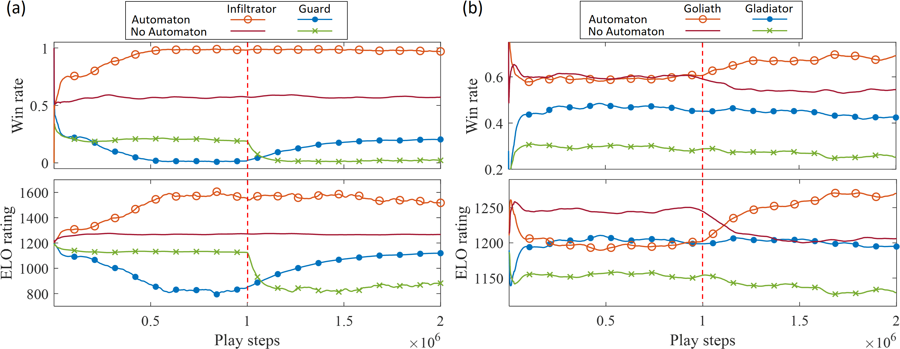

### Results


### Environment setup
- We assume the following PC configuration:
  - Linux operating system (Ubuntu 18.04 LTS preferred)
  - CUDA-compatible GPU
  - CUDA library installed
  - Anaconda distribution installed (https://www.anaconda.com/)

- In the root of source code folder, run the following commands:
````
conda create -n "agrs" python=3.7.6
conda activate agrs
conda install pip
pip install -r requirements.txt
pip install torch==1.2.0 torchvision==0.4.0 -f https://download.pytorch.org/whl/torch_stable.html
````

### Running homogenous competitive experiments:

##### Script Template:
- `python autograph/play/maze_nn_aut_adv_team_share.py 
--workers N 
--device cpu/cuda:N 
--checkpoint path/to/checkpoint 
--checkpoint-every N
--log path/to/tensorboard/log/folder 
path/to/config/file.json`


- Performance may start to degrade if there are too many worker threads. Recommended 4-6.
- Make sure that the root folder (containing autograph and schemas) is the working directory or is on PYTHONPATH
- If you exclude checkpoint-every, it defaults to 1 (checkpoint every episode)
- Or include `--do-not-save-checkpoint`
- For experimental runs, use the flag `--hide-play-step`
- To watch the play steps, use only one CPU worker thread `workers 1`
- Also, make sure that the folder the checkpoint gets saved to is already created
- When editing the configuration files, make sure that your editor treats json files as [JSON5](https://json5.org/)
(instructions for [Pycharm](https://www.jetbrains.com/help/idea/json.html#ws_json_choose_version)) 
- It can automatically `--stop-after` a certain number of environment steps. We use One million steps per each experiment. 
- The JSON config schema is in `schemas/config_schema.json`
- The `--run-name` parameter will substitute a `%s` in the log, checkpoint, and config arguments:
  - For example, one experiment was run with `--run-name AutvAut
--device
cuda:0
--workers
6
--post
cas
--checkpoint-every
4
--log
runs/mcts/%s
--checkpoint
checkpoints/%s
config/guardInf/newActions/full_500_Auts_10by10.json`
- View logged results in tensorboard
  - run/total_reward shows rewards for each team
  - run/length shows the average length of each run
  - run/elo shows the ELO rating of each team as they compete.
  - Recommended smoothing of 0.99
- Follow above steps to run the Aut versus Aut game, where each team's policies are shaped by intermediate automaton objectives.
- Also run the NoAut versus NoAut games, where intermediate reward shaping is not used `full_500_NoAuts_10by10.json`
### Running swapped Opponent Experiments

- Before running the swapped opponent experiments, we must rename our checkpoints within the file system.
    - AutvAut_guard BECOMES AutGuard_guard
    - AutvAut_inf BECOMES AutInf_inf
    - NoAutvNoAut_guard becomes AutInf_guard
    - NoAutvNoAut_inf becomes AutGuard_inf
- Make sure these checkpoints are all in the specified checkpoints folder
- Repeat steps above to run the experiment twice with AutGuard and AutInf as the runnames. 
- The checkpoints, carrying a million replay buffer states and net-weights, will be loaded in and our Automaton teams will directly compete with the teams lacking an automaton.
- Because these swapped checkpoints have already run a million steps, we must specify `--stop-after 2000000`

### Analyzing Checkpoint Policies

- In order to analyze the policies of checkpoints within a specific scenario or a game scenario
    - Open a jupyter notebook and navigate to tests/test_aut_adv_team_share
    - Substitute the checkpoint path you wish to analyze, along with json, and run_name. 
    - Reference the `tests/test_aut_adv_team_share/Unit_test_legend.png` for explanation of policy visualization. 
    - Either run an entire game or specify actions and see policies at a specific state. 
    
### General Tips    


##### After every restart: 
	- open cmd
	- change directory to the code directory
	- run: "export PYTHONPATH=."

##### For every run: 
	- check/change checkpoints filenames if swapping
	- events logs for tensorboard

##### To use tensorboard:
	- open cmd
	- change directory to the event log path: path\to\tensorboard\log\folder
	- run: "tensorboard --logdir ."
	- copy the link in cmd and use a browser to see the progress

##### Parameters for JSON defines:
	- LTLf formula for each team: 
	spec: "G(wood -> F(factory)) & F(tool_3 & at_home)",
	
	- specify which teams use intermediate aut-shaping (dont_use_aut = boolean)
	- specify partial distance per agent
	- env specs
	- episodes length
	- agrs mats expansions: batch_size X num_batches
	- CNN training parameters


##### Get variables from the JSON by using config, for example:
	- in maze_nn_aut.py: env = config["env"]

##### MATS expansions take place in mcts_aut_adv_team.py, 
##### class: MCTSAutAdvList, with functions: 
	- pick_action --> pi_tree
	- find_leaf   --> stacks up training examples(for CNN) in variable turns
	              --> This happens num_batches * batch_size times (20*4 = 80 in our case).
	- find_leaf_batch
	- backup_mcts_trace
	- mcts_mini_batch

- pi_play takes places in mcts_aut_adv_team.py, class: MCTSAutAdvList, with function: get_policy_value

- LTL parser is at automata.py / class: AutomatonGraph / func: from_hoa

- N_LTL and W_LTL get updated at the end of every episode at mcts_aut_adv_team.py / class: AutStats / func: v

- Environment main file is autograph\lib\envs\mineworldenv_team.py , any interactions with env (tree search or play steps) take place from classes and functions of this file

- The render function for printing out the env at every checkpoint is at: mineworldenv_team.py / class MineWorldEnv function render

- In tensorboard, the win_rate plot is generated from: autograph\lib\running.py

- In function find_leaf, the flag to stop agrs mats expansions is 'done' which get updates from the step function in shapeenv.py as:
	- class: AutShapingWrapperAdv / function step

- The NoAut runs still use their automaton to see if their objective has been satisfied, but they don't use intermediate rewards.

- To see the exact play steps, run a process with one worker, and don't use the flag --hide-play-step.


